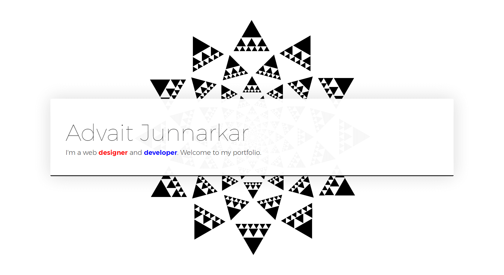
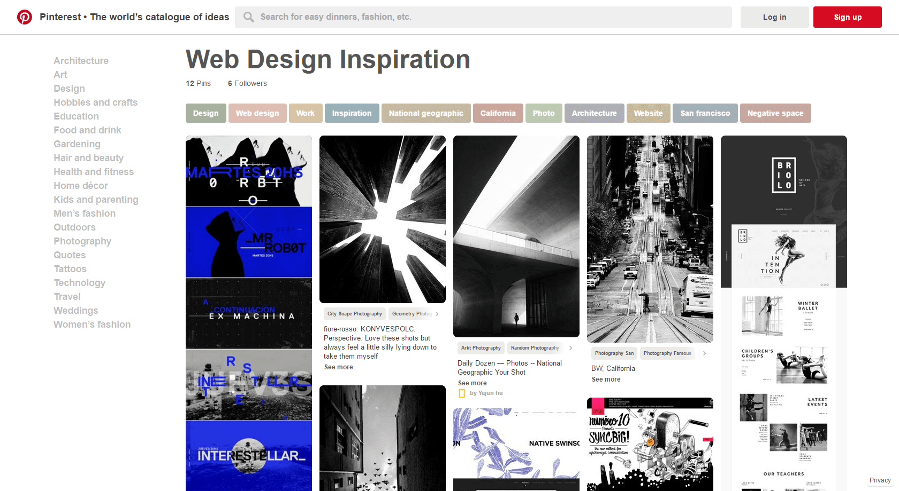
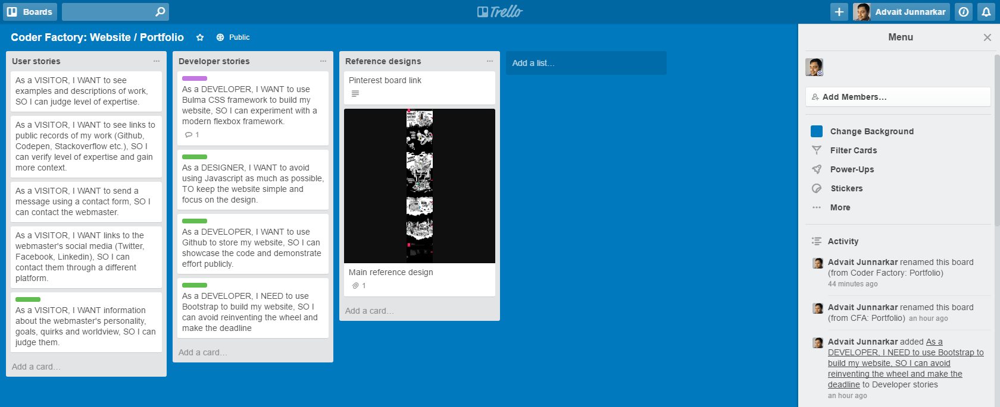

# <a href="https://advaitju.github.io/Website-Portfolio/" target="_blank">Website-Portfolio</a>
### <a href="https://advaitju.github.io/Website-Portfolio/" target="_blank">Visit website</a>

## About
My personal website / portfolio to showcase my skills, work, personality and goals.

## Tech
### CSS
1. Normalize.css
2. Bootstrap
3. Font Awesome

### Js
1. jQuery

## Design Process
I started working on the Website / Portfolio by creating a mood board on Pinterest > Followed by an AGILE approach (Epics-Stories) detailed on Trello > Followed by many hours of knuckle-cracking dev.

### Pinterest

More on Pinterest: https://au.pinterest.com/advaitju/web-design-inspiration/

### Trello

More on Trello: https://trello.com/b/HWQamff8/coder-factory-portfolio
